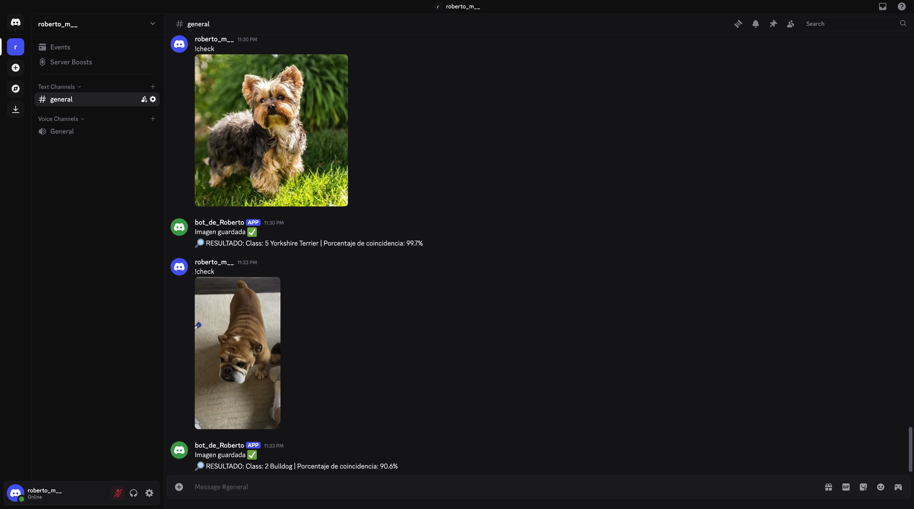

# Bot Clasificador de Imágenes para Discord

Este bot de Discord utiliza un modelo de Keras entrenado para clasificar imágenes que los usuarios envían en el chat. Al subir una imagen, el bot la guarda, la procesa y responde con la categoría y el porcentaje de confianza. Las imagenes que procesa son imágenes de perros, pero sólo hay 10 razas en el modelo, por lo que hay muchas razas que no aparecen, por lo tanto un porcentaje de coincidencia menor al 50% indica que el perro de la imagen enviada no pertenece a ninguna de las razas que el modelo puede identificar o que la imagen no aporta suficiente información para identificar la raza.

## Cómo funciona

- El bot recibe imágenes como archivos adjuntos.
- Guarda la imagen en la carpeta `imagenes/`.
- Usa el modelo `keras_model.h5` y las etiquetas en `labels.txt` para hacer la predicción.
- Responde en Discord con la clase predicha y la confianza en porcentaje.

## Archivos importantes

- `bot.py`: código principal del bot.
- `modelo.py`: función para cargar el modelo y hacer predicciones.
- `keras_model.h5`: modelo preentrenado.
- `labels.txt`: etiquetas usadas para clasificar.
- `imagenes/`: carpeta donde se guardan las imágenes enviadas.

## Ejemplo de uso

## Licencia

Este proyecto está bajo la licencia MIT. Mira el archivo LICENSE para más detalles.
